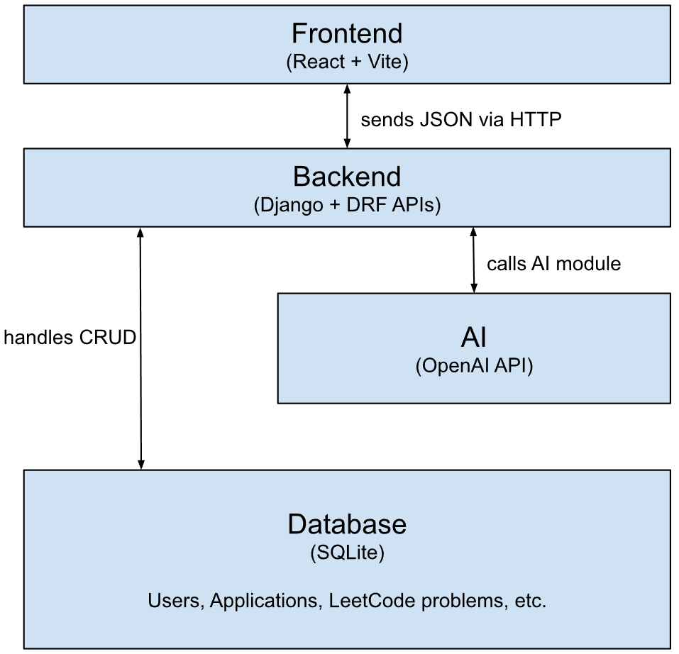

# Job Application Management System  
*A Smart Application Tracking & Skill Recommendation Platform*

## Introduction  
Our **Job Application Management System** is a full-stack web platform that helps users organize their job search and application process. Job seekers often lose track of deadlines, stages, and required skill requirements across many platforms. Our application allows users to:

- Track various applications on a centralized dashboard
- Get suggestions by AI on skills to practice
- Get recommended LeetCode problems from job position applied to
- Upload profile & resume
- Chat with AI to get further suggestions

There are some existing application similar to our application such as LeetCode and Simplify. But they rather focus on one part of the application process (tracker, practice questions, etc.) while our application integrate them together. Moreover, compared with existing spreadsheets or job-tracking tools, our system is **smarter** and **more personalized**: the AI analyzes job descriptions and the user's background to recommend specific skills and practice problems—reducing stress and improving preparation efficiency.

Motivation: Searching for jobs is overwhelming. We wanted to build a tool that *we ourselves would use*—a platform combining tracking, organization, and personalized learning guidance.

---

## Technical Architecture

### System Overview



### Backend
**Functionalities**: The backend is responsible for managing user data, authentication, file uploads, and AI-powered recommendations.

**Programming Lan**: We built the backend using Python with the Django framework, as two team members are already familiar with Python. And we learned Django, a framework that is good for rapid development, scalability, and security.

**Interactions with frontend**: The backend communicates with the frontend through Django REST Framework. This method ensures a clean client–server separation and makes the project modular and easier to scale.


### Frontend
**Functionalities**: The frontend provides the user interface for interacting with the system (UI and form to create application/upload resume). 

**Programming Lan**: The frontend is implemented with React, JavaScript, HTML, and CSS.

**Interactions with backend**: The frontend sends HTTP requests to backend APIs to retrieve and update data. This client-server communication method keeps the UI decoupled from backend logic and simplifies integration.


## Installation Instruction

### 1. Clone the repository
```bash
git clone https://github.com/CS222-UIUC/fa25-fa25-team39.git
cd fa25-fa25-team39
```

### 2. Setup environment variable
```bash
cp .env.example .env
# Edit .env and fill in your own values (e.g. OPENAI_API_KEY)
```

### 3. Setup using docker
```bash
docker-compose up --build
```

You may need to setup the database and create superuser for the first time
```bash
# In another terminal:
# setup database
# - migrate
docker compose exec backend python manage.py migrate
# - upload the first 3758 leetcode problems
docker compose exec backend python manage.py get_leetcode_problem

# create superuser by this command, following the instruction
docker compose exec backend createsuperuser
```

You can check if both backend and frontend are running using the command
```bash
docker-compose ps
```

### 4. Using the website
Now you should be able to use the frontend website at http://localhost:5173/

And the backend database at http://localhost:8000/admin/ (using your own account)

## Members

| Name             | Role                     | Responsibilities                                                |
| ---------------- | ------------------------ | --------------------------------------------------------------- |
| **Zhijian Yang** | Full-stack + Integration | Connect React & Django, assist backend, deployment, using API   |
| **William Lu**   | Backend                  | Models, authentication, AI recommendation, leetcode             |
| **Liyuan Lu**    | Backend                  | Resume upload, REST API endpoints, database schema              |
| **Yantao Lin**   | Frontend                 | UI components, dashboard, forms, login page                     |
